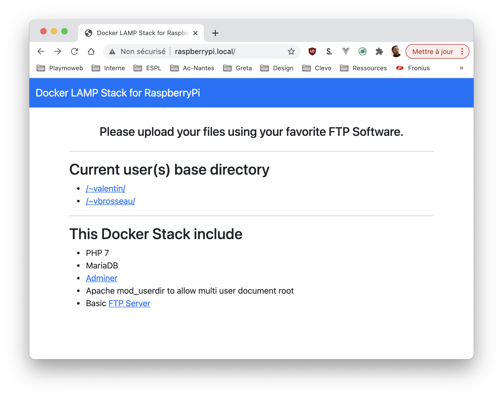
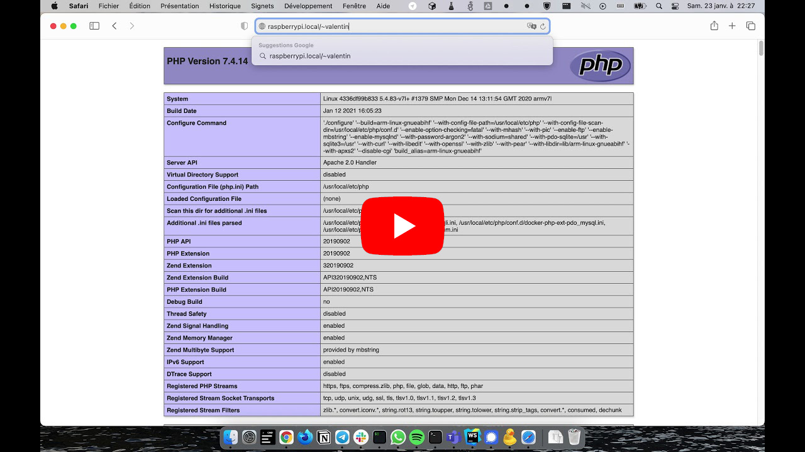

# Multi-User Docker LAMP Stack for RaspberryPi (32bit)

The purpose of this image is to quicly build an multi users LAMP stack with Docker using a Raspberry Pi 4 **32bit**.

- Web : Apache + PHP (php 7 & adminer)
- Database : `tobi312/rpi-mariadb` (not the official image since armv7 is not supported)
- FTP: custom ftp service to upload your source remotely (see below for password / username pattern)

| Service |  Port |
| ------- | ----: |
| HTTP    |    80 |
| FTP     | 20121 |
| SQL     |  3306 |

**FOR TESTING/EVALUATION ONLY - NOT FOR PRODUCTION**
**I REPEAT DO NOT USE IT IN PRODUCTION**



## Quick usage

```sh
docker-compose up -d
```

- [LAMP Stack Dashboard Access : http://raspberrypi.local/](http://raspberrypi.local/)
- [Adminer Access : http://raspberrypi.local/adminer/](http://raspberrypi.local/adminer/)

Adminer configuration to specify :

```sh
host: mariadb
user: root
password: MARIADB|secret
```

User home directory is automatically created when the user do his first FTP connection.

## FTP : How to upload your files

The provided docker stack include an FTP server. This FTP server _is not meant to be open to the public_

### Mode 1 : Auto-generated user & password

Its accepts connections from all user / password pairs as long as they match the correct pattern.

_Password are automaticaly generated using this pattern :_

```sh
# Example
username: john
password: RPI|john|LAMP

# Or
username: valentin
password: RPI|valentin|LAMP

# Or
username: sample
password: RPI|sample|LAMP

# Or
username: anythingyouwant
password: RPI|anythingyouwant|LAMP

# etc...
```

You can change this behavior by changing the `PASSWORD_PREFIX` and `PASSWORD_SUFFIX` settings in the `environment.yml` file.

#### Usage Example

If you try to do an FTP login with the username `valentin` the password will be `RPI|valentin|LAMP`.

The document root of the user `valentin` and `valentin/public_html` will be automatically created on the first FTP connection.

After this first connection users files will be alse available via the browser at :

[http://raspberrypi.local/~valentin](http://raspberrypi.local/~valentin)

### Mode 2 : Specified User & Password

In this mode you can specify allowed user & password. The FTP stack will act like a classical FTP server. You can specify your username and password in the `ftp/users/users.json` file.

_Example_

```json
{
  "yourUsername": "yourPassword"
}
```

⚠️ No restart required ⚠️

_Note:_ The mode 1 & 2 are not enabled together. If you add and account in the `users.json` file the « Auto-generated » behavior will be disabled

## Live example

[](https://www.youtube.com/watch?v=y7HzFidjKjs)
